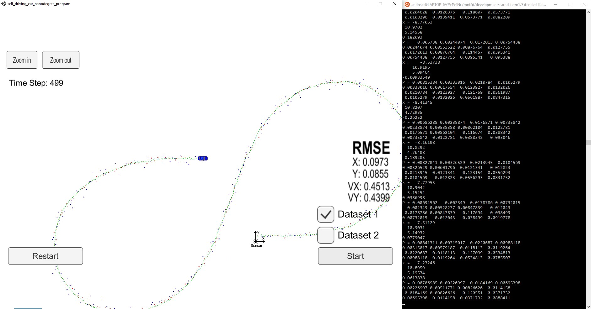
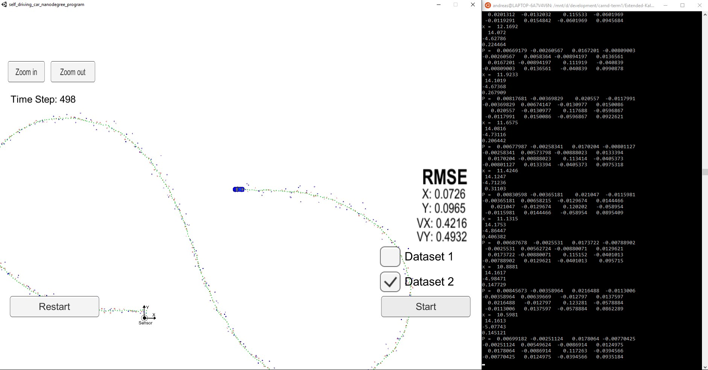

# **Extended Kalman Filter**

#### Udacity Self Driving Car Engineer Nanodegree - Project 5

### Overview

In this project you will utilize a kalman filter to estimate the state of a moving object of interest with noisy lidar and radar measurements. Passing the project requires obtaining RMSE values that are lower than the tolerance outlined in the project rubric. 

This project involves the Term 2 Simulator which can be downloaded [here](https://github.com/udacity/self-driving-car-sim/releases)

### Prerequisites
To compile this project the following programming environment is required:

* cmake >= 3.5
  * All OSes: [click here for installation instructions](https://cmake.org/install/)
* make >= 4.1 (Linux, Mac), 3.81 (Windows)
  * Linux: make is installed by default on most Linux distros
  * Mac: [install Xcode command line tools to get make](https://developer.apple.com/xcode/features/)
  * Windows: [Click here for installation instructions](http://gnuwin32.sourceforge.net/packages/make.htm)
* gcc/g++ >= 5.4
  * Linux: gcc / g++ is installed by default on most Linux distros
  * Mac: same deal as make - [install Xcode command line tools](https://developer.apple.com/xcode/features/)
  * Windows: recommend using [MinGW](http://www.mingw.org/)
  
* [uWebSocketIO](https://github.com/uWebSockets/uWebSockets) library for either Linux or Mac systems. For windows you can use either Docker, VMware, or even [Windows 10 Bash on Ubuntu](https://www.howtogeek.com/249966/how-to-install-and-use-the-linux-bash-shell-on-windows-10/) to install uWebSocketIO.

### Compiling and executing
Follow these instructions to compile and run this project:

1. Clone this repo (https://github.com/aboerzel/Extended-Kalman-Filter.git).
2. Make a build subdirectory and change to it with: `mkdir build && cd build`
3. Compile the project using the command: `cmake .. && make` 
   * On windows, you may need to run: `cmake .. -G "Unix Makefiles" && make`
4. Run the project with: `./ExtendedKF `

### Running the Extended Kalman Filter
Follow these instructions to test the project:

1. Run the Kalman filter project with command from the build subdirectory: `./ExtendedKF `
2. Run the [Simulator](https://github.com/udacity/self-driving-car-sim/releases) and select `Project 1/2: EKF and UKF` 
3. Select `Dataset 1` or `Dataset 2` and press the `Start` button.

Example run of the project with dataset 1:

The resulting RMSE [.0973, .0855, 0.4513, 0.4399] is smaller than the max RMSE [.11, .11, 0.52, 0.52] from the [project rubric](https://review.udacity.com/#!/rubrics/748/view).

Example run of the project with dataset 2:

The resulting RMSE is: [.0726, .0965, 0.4216, 0.4932].
